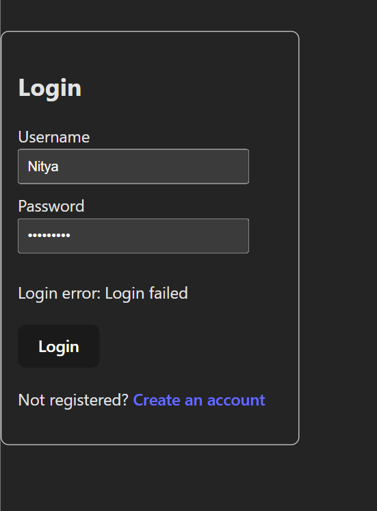
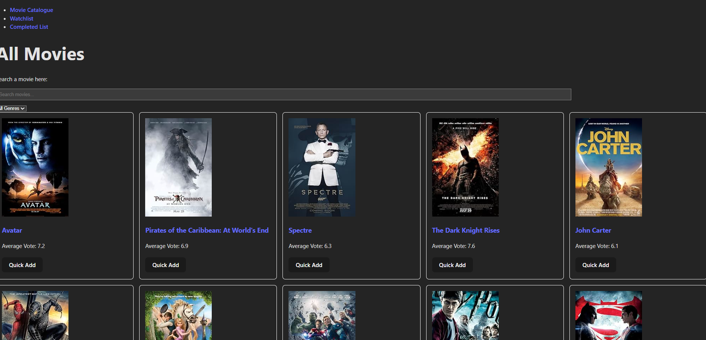
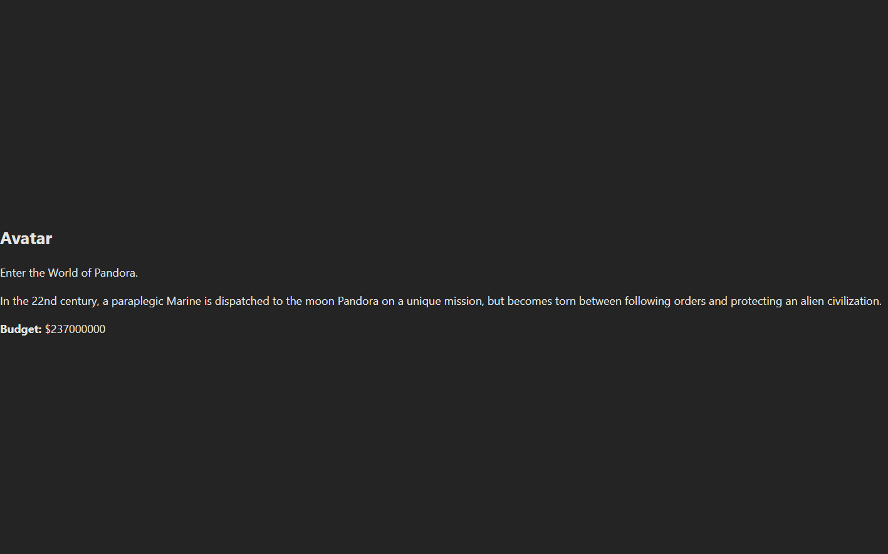
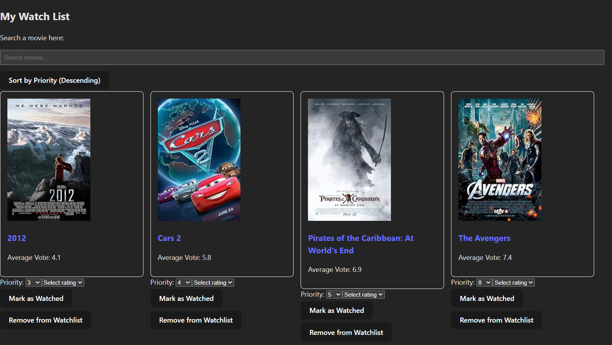
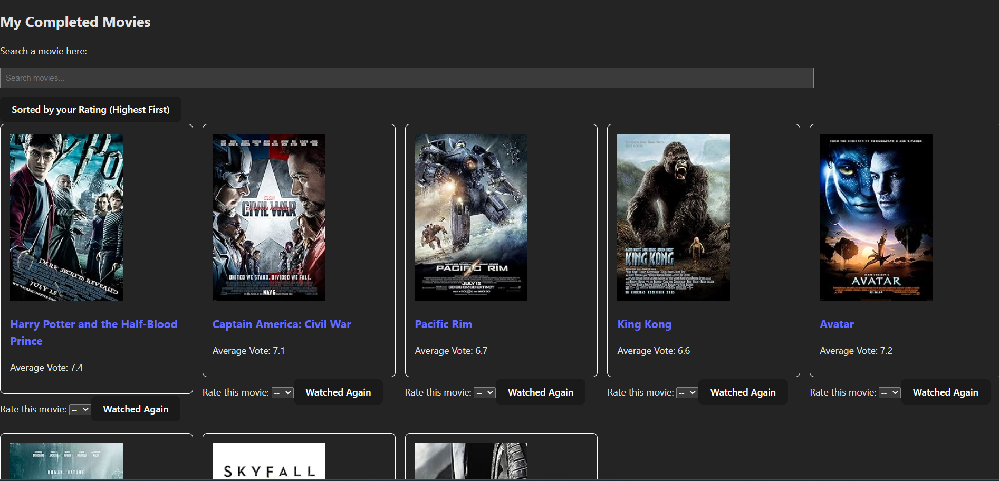

# MovieStreamingApp using PHP, MySQL, React, TypeScript

This project demonstrates full-stack web development using PHP, MySQL, React, and TypeScript. It includes a custom RESTful API, secure authentication, dynamic movie lists, and a responsive front-end interface. The goal was to build a realistic, interactive application that integrates backend logic, database operations, and modern client-side development practices.

## Overview

MovieStreamingApp is a multi-component full-stack project that highlights the design and integration of a custom backend API with a modern React + TypeScript frontend. It includes:
* A PHP-based REST API for movies, user accounts, watchlists, and ratings.
* A React single-page application for browsing, filtering, and managing personalized movie lists.
* Secure session-based authentication and API key validation.
* Dynamic UI updates, filtering, and rating features.

This project emphasizes backend routing, SQL integration, authentication, state management, and responsive UI development.

## Demo

This project includes five screenshots demonstrating the main components of the application:
* **Login Page (Invalid Credentials):** A screenshot showing the login form displaying an error message when incorrect credentials are entered.

* **Movie Catalogue Page:** A screenshot of the main movie catalogue displaying available titles, genres, ratings, and filtering options.

* **Movie Details View (Clickable Title):** A screenshot showing the detailed movie view that appears when clicking a movie title, including summary, budget, and additional information.

* **WatchList Page:** A screenshot showing the user's personalized WatchList with priority, notes, and options to remove or move movies.

* **CompletedWatchList Page:** A screenshot of the CompletedWatchList displaying user ratings, watch counts, and updated averages.

More screenshots, including full ThunderClient results for all API requests and endpoints, can be found in the [testing_screenshots](./Frontend/testing-screenshots/) folder.

## Purpose

This project was completed as part of COIS 3430 - Web Development: Backend at Trent University. It combines two assignments to create a full-stack movie streaming and review platform. It demonstrates my ability to design and implement a full-stack application using a custom REST API, secure authentication, SQL-driven data management, and a modern React + TypeScript frontend. The project reflects real-world development practices, including API testing, state management, and responsive UI design.

## Features

This project is divided into two major parts, each focusing on a different aspect of full-stack development:
1. **Backend API (PHP & MySQL)**
   * **Movie Catalogue Endpoints:** Provides full movie data including title, genre, rating, summary, and budget, with support for dynamic filtering and searching.
   * **WatchList Management:** Allows users to add movies, update priority or notes, and remove items using structured CRUD endpoints.
   * **CompletedWatchList Management:** Supports rating updates, watch count increments, and automatic recalculation of average ratings.
   * **User Authentication:** Implements secure session-based login, account creation, and API key generation for authorized requests.
   * **User Statistics:** Returns personalized stats such as total movies watched, average rating, and list counts through dedicated endpoints.
2. **Frontend Application (React & TypeScript)**
   * **Movie Catalogue Interface:** Displays all movies with filtering options and responsive layout. Movie titles are clickable, opening a detailed view including summary and budget.
   * **WatchList Interface:** Shows user-selected movies with priority, notes, and options to move or remove items, with all updates synced to the backend.
   * **CompletedWatchList Interface:** Displays completed movies with rating selectors, watch counts, and updated averages, reflecting backend changes instantly.
   * **Authentication Flow:** Includes login, logout, and protected routes using React Context for session state management.
   * **Reusable Components:** Uses modular components for cards, lists,  and filters to maintain clear structure and consistent UI across the application.

## Problems Faced

* **Defining a BASE URL for All Endpoints:** Setting a consistent BASE URL for API requests was challenging because different environments required different paths. Ensuring every fetch call used the correct base route took careful  organization and repeated testing to avoid broken or inconsistent responses.
* **Designing Efficient Filtering and Search Endpoints:** Creating flexible filtering logic required handling multiple optional parameters without producing overly complex SQL queries. Ensuring accurate results while keeping the backend efficient involved several iterations and careful validation of each filter combination.
* **Writing SQL Queries With Multiple Optional Conditions:** Constructing SQL queries that adapted to various filter combinations was difficult because each condition needed to be optional. Ensuring the final query remained valid, secure and performant required thoughtful structuring and debugging.
* **Creating the Rating Selector in CompletedWatchList:** Implementing a rating selector that updated both the UI and backend consistently was challenging. Ensuring the selected rating triggered correct state updates, recalculated averages, and refreshed the interface without stale data required careful synchronization.

## Key Decisions

* **Creating a Dedicated `types` Folder for TypeScript Interfaces:** Separating all TypeScript interfaces into a dedicated `types` folder improved clarity and consistency across components. This structure reduced duplication, simplified imports, and ensured the frontend maintained predictable data shapes throughout the application.
* **Building a Central `index.php` Documenting All Endpoints:** Creating a central `index.php` file listing every route and method provided a clear overview of the API. This decision improved backend organization, simplified debugging, and acted as lightweight documentation for anyone reviewing the project.
* **Implementing Real-World Features Like Filtering and Rating:** Choosing to include filtering, rating, and watch-count features made the application feel more realistic and aligned with actual streaming platforms. These additions strengthened the project's complexity and demonstrated practical full-stack development skills.
* **Using ThunderClient to Verify Endpoint Functionality:** ThunderClient was used extensively to test each endpoint before frontend integration. This decision ensured consistent responses, validated request structures, and prevented frontend errors caused by incorrect or incomplete backend behavior.

## Code Structure

The project is organized into two main folders - Backend and Frontend - each containing all files and subdirectories required for API functionality, authentication, UI rendering, and testing.
1. **Backend**
   * `create-account.php`: Handles new user registration and account creation
   * `index.php`: Landing page for backend navigation
   * `login.php`: Authenticates users and initializes sessions
   * `view-account.php`: Displays user account details
   * `api`
     * `auth.php`: Manages login validation and session authentication
     * `completedwatchlist.php`: Handles completed movie list operations (ratings, watch count, averages)
     * `index.php`: API entry point and router
     * `movies.php`: Returns movie catalogue including summary, budget when movie title is clicked
     * `towatchlist.php`: Manages WatchList operations (add, update, remove)
     * `users.php`: Retrieves user-specific statistics and account information
   * `styles`
     * `main.css`: Styling for backend account pages and API interface
2. **Frontend**
   * `assn3-Nitya-star-build`
     * `App.css`: Global styling for main application layout
     * `App.tsx`: Root component controlling app structure and routing
     * `index.css`: Base styles applied across entire React app
     * `main.tsx`: Entry point that renders the React application
     * `components`
       * `CompletedList.tsx`: Displays completed movies with rating and watch count controls
       * `LoginForm.tsx`: Handles user login and authentication UI
       * `MovieCard.tsx`: Renders individual movie cards with clickable titles
       * `MovieCatalogue.tsx`: Shows full movie catalogue with filtering and search
       * `MovieDetail.tsx`: Displays detailed movie information (summary, budget)
       * `SearchBar.tsx`: Provides search functionality for the catalogue
       * `WatchList.tsx`: Shows the user's WatchList with priority and notes
     * `context`
       * `AuthContext.tsx`: Provides global authentication state and session handling
     * `styles`
       * `LoginForm.css`: Styling for the login page
       * `MovieCard.css`: Styling for each of the movies present in all the lists
       * `MovieCatalogue.css`: Styling for all the movie lists
       * `WatchList.css`: Styling for the WatchList specifically
     * `types`
       * `types.ts`: Defines TypeScript interfaces for movies, users, and API responses
   * `testing-screenshots`
       * Contains five subfolders with ThunderClient API request screenshots
       * Includes all UI screenshots used in the Demo section
 * **Note:** Sensitive configuration files (e.g. database credentials) are intentionally excluded for security reasons.

## Technical Skills Demonstrated

* **Programming Languages:** PHP, TypeScript, JavaScript, SQL, HTML5, CSS3
* **Backend Concepts:** REST API Design, Session Handling, Authentication, CRUD Operations, Input Validation
* **Database Skills:** MySQL Queries, Table Design, Joins, Prepared Statements
* **API Techniques:** Endpoint Structuring, JSON Responses, Error Handling, Modular Routing
* **Frontend Skills:** React Components, State Management, Context API, Conditional Rendering, Event Handling
* **Application Logic:** Movie Catalogue Filtering, WatchList Management, Rating Updates, Average Calculations
* **Development Environment:** Visual Studio Code, ThunderClient, GitHub, Browser DevTools, Local PHP Server

## Learnings

* **Importance of API Testing Tools in Development:** Using ThunderClient highlighted how essential independent endpoint testing is for backend reliability. Validating responses before connecting them to the frontend prevented unnecessary debugging and improved the overall development workflow.
* **Understanding HTTP Methods and Endpoint Design:** Building multiple endpoints helped me understand the purpose and differences between GET, POST, PUT, PATCH and DELETE. Designing routes that followed REST conventions strengthened my understanding of structured backend development.
* **Managing Authentication Across Two Systems:** Implementing both PHP session-based login and API key authentication taught me how real applications separate browser authentication from programmatic access. Coordinating these systems improved my understanding of secure, multi-layered authentication.

## Improvements (Future Work)

* **Introduce Role-Based Access Control for Users:** Adding role-based access control would allow features like admin-level movie management or review moderation. This enhancement would improve security, expand functionality, and make the application feel more aligned with real-world problems.
* **Add a Clear Filters Button for Better Usability:** A dedicated "Clear Filters" button would improve navigation by allowing users to reset all applied filters instantly. This small addition would make browsing smoother and reduce confusion when multiple filters are active.
* **Add Confirmation Dialogs for Sensitive Actions:** Adding confirmation dialogs before deleting movies or regenerating API keys would prevent accidental actions. This improvement would enhance user experience, reduce mistakes, and make the interface feel more polished and intentional.